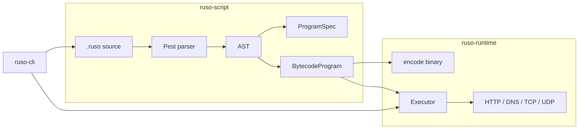

# Architecture overview

Ruso splits **language** (script + compiler) from **execution** (runtime VM). The CLI is a thin driver. This keeps the bytecode contract stable while the DSL evolves.

> **Canonical copy:** [ruso-runtime/docs/ARCHITECTURE.md](https://github.com/Hopeless-Labs/ruso-runtime/blob/main/docs/ARCHITECTURE.md) (bytecode, executor, networking). This file is duplicated here so DSL authors have system context in the **ruso-script** repo.

## End-to-end flow



1. **Parse** — `grammar.pest` → `Program { statements }`.
2. **Build spec** — metadata + probe definitions → `ProgramSpec` (probe table only; no control flow).
3. **Compile** — executable statements → `Vec<Instr>` + string/matcher/payload pools.
4. **Execute** — `Executor` walks instructions, calls `send_probe`, evaluates matchers, emits findings.

## Why probes are not opcodes

Enterprise scanners often embed protocol logic in plugins. Ruso instead uses:

| Layer | Responsibility |
|-------|----------------|
| **Probe table** | *What* to send (HTTP path, TCP payload, DNS wire bytes, …) |
| **Instructions** | *When* to send and *how* to branch (`Send`, `Match`, `Repeat`, …) |

There is a single network opcode:

```text
Send { probe_id, optional_payload_override }
```

`ProbeKind` in the probe table distinguishes HTTP vs DNS vs TCP vs UDP. Adding a Redis check does **not** add `OP_REDIS`; it adds a `tcp` probe with a RESP payload in a `.ruso` file.

Benefits:

- Scripts ship without recompiling the VM.
- Bytecode stays small and stable.
- Same executor path for all TCP-based services.

Trade-off: very complex protocol state machines still need either richer generic options (`session`, `read_idle`, loop) or future opcodes—not per-service hardcoding.

## Three crates

### `ruso-runtime`

- **Public API**: `Executor`, `ExecutorConfig`, `BytecodeProgram`, `encode_bytecode` / `decode_bytecode`, `ProgramSpec`, `SocketProbeSpec`, contract types.
- **Does not parse** `.ruso` source.
- Owns all network I/O (reqwest, tokio sockets, tokio-rustls).

Key modules:

| Module | Purpose |
|--------|---------|
| `contract.rs` | Matchers, severity, HTTP method, evidence |
| `runtime/spec.rs` | `HttpRequestSpec`, `SocketProbeSpec`, `ProbeKind` |
| `runtime/bytecode.rs` | `Instr` enum |
| `runtime/binary.rs` | Wire encode/decode v1 |
| `runtime/executor.rs` | VM main loop |
| `runtime/http.rs` | HTTP client requests |
| `runtime/session.rs` | TCP/TLS connect, multi-read, UDP |
| `runtime/socket.rs` | One-shot and session exchanges |
| `runtime/dns.rs` | OS resolver vs wire UDP DNS |
| `runtime/matcher.rs` | Field predicates |
| `runtime/context.rs` | Variables, responses, sessions, loop stack |

### `ruso-script`

- **Public API**: `parse()`, `compile()`, `Program`, AST types.
- Depends on `ruso-runtime` for `ProgramSpec` and contract types.
- Pest grammar is the source of truth for syntax.

Pipeline: `parse` → `build_program_spec` → `compile`.

### `ruso-cli`

- Clap CLI: `scan`, `parse`, `compile`, `exec`.
- Wires `ExecutorConfig` (base URL, timeout, TLS verify, proxy) from flags.
- Discovers `.ruso` files and target lists for batch scans.

## Repositories (not a monorepo)

Three separate Git repos: [ruso-runtime](https://github.com/Hopeless-Labs/ruso-runtime), **ruso-script** (this repo), [ruso-cli](https://github.com/Hopeless-Labs/ruso-cli). A parent folder like `Hopeless-Labs/` on disk is not a git repository.

```text
ruso-cli → ruso-script → ruso-runtime
```

## Generic socket model

`dns`, `tcp`, and `udp` blocks all parse into the same `SocketProbe` / `SocketProbeSpec`:

```rust
pub struct SocketProbeSpec {
    pub host: String,
    pub port: Option<u16>,
    pub payload: Option<Vec<u8>>,
    pub tls: bool,
    pub session: bool,
    pub read_max: u32,
    pub read_idle_ms: u32,
}
```

Runtime behavior is selected by **probe kind** + **field values**:

| Kind | Condition | Behavior |
|------|-----------|----------|
| `Dns` | no `port`, no `payload` | OS resolver (`tokio::net::lookup_host`) → `ProbeResponse::DnsResolve` |
| `Dns` | `port` and/or `payload` | UDP to `host:port` (default 53) → `ProbeResponse::Socket` |
| `Tcp` | `port` required | TCP (+ optional TLS) exchange → `Socket` |
| `Udp` | `port` required | UDP exchange → `Socket` |

HTTP uses a separate `HttpRequestSpec` because the model is request/response document-oriented, not raw socket bytes.

## Execution state

`Context` holds per-run state:

- `variables` — `set` / `extract`
- `responses` — map probe name → `ProbeResponse`
- `sessions` — open TCP/TLS or UDP sockets when `session true`
- `loop_stack` — `Repeat` / `LoopBack` / `Break`
- `matched` — AND-chain for matchers until one fails
- `evidence` — strings for the final finding

## Findings

A finding is emitted when:

1. Match chain stayed true (`context.matched`), and
2. `finalize_finding()` runs at end of bytecode (metadata name/severity + evidence).

Flow instructions: `stop`, `exit` (halt VM), `fail` (error), `continue`, `break` (exit innermost `repeat`).

## What Ruso is not (yet)

- Not a scan orchestration platform (scheduling, workers, asset DB).
- Not a plugin marketplace (checks are `.ruso` files you ship).
- Not a full web crawler / Burp replacement.

It **is** a solid **check execution engine** with a small, generic bytecode ISA.
